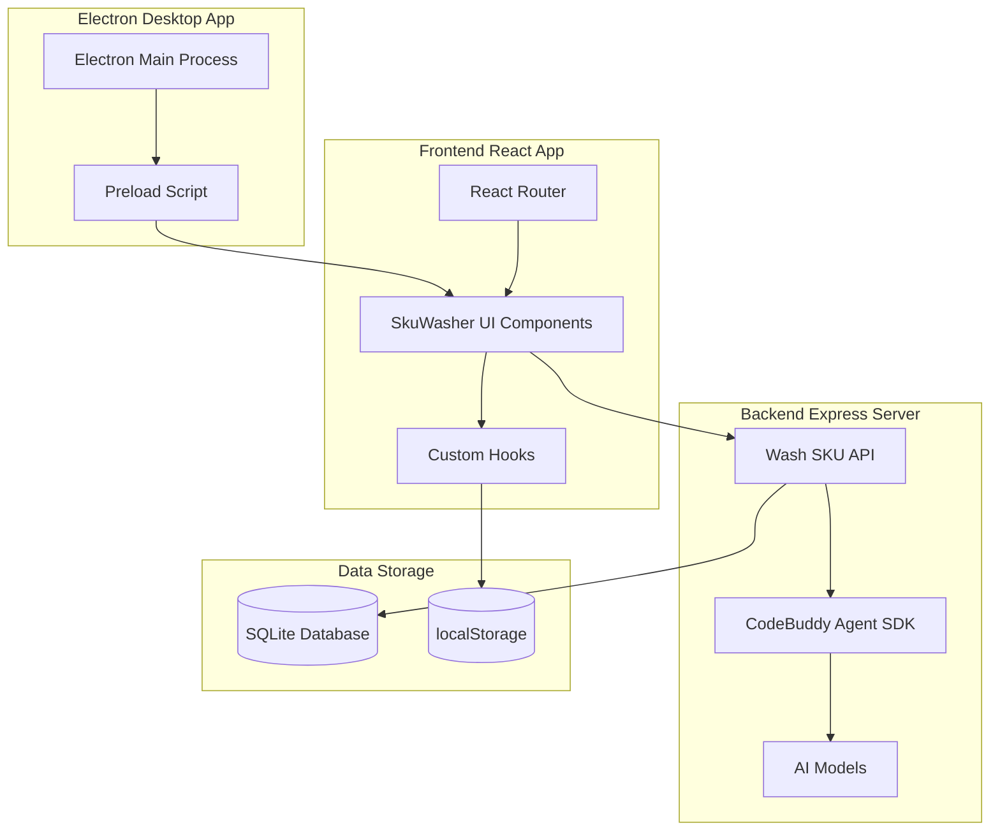

## 产品概述

基于 CodeBuddy SDK 创建一个客户端 Agent Web 应用，实现电商 SKU 智能改写功能，通过 AI 改写降低平台比价识别概率，并用 Electron 封装为桌面应用。

## 核心功能

- SKU 输入区域：支持粘贴多行原始 SKU 文本，每行一条
- 智能改写：使用 CodeBuddy AI 模型改写 SKU，支持标准、轻度、深度三种改写强度
- 批量处理模式：支持逐行改写和整体改写两种模式
- 改写规则管理：可自定义改写规则（system prompt），预设完整改写逻辑
- 历史记录：保存洗词历史，支持查看和加载历史记录
- 结果管理：改写结果逐行显示，支持单行复制和全部复制
- Electron 封装：打包为桌面应用，支持离线使用和本地数据存储
- Web 开发模式：确保可以在浏览器中开发和调试

## 改写规则核心要点

- 使用符号改变结构：【】（）-+/丨：
- 使用近义词替换，特别是颜色词
- 保留 SKU 核心含义，不改变商品信息
- 只输出改写结果，不添加任何解释

## 技术栈选择

- **后端**: Express + TypeScript + CodeBuddy Agent SDK (@tencent-ai/agent-sdk)
- **前端**: React 18 + TypeScript + Vite
- **UI 组件库**: TDesign React（项目已集成）
- **样式**: Tailwind CSS
- **数据存储**: SQLite（用于会话） + localStorage（用于历史记录和规则）
- **桌面封装**: Electron
- **构建工具**: Vite + electron-builder

## 实现方式

### 策略概述

基于现有的 CodeBuddy SDK Web 应用模板，改造为专用的 SKU 洗词工具。保留模板的后端架构和 Agent SDK 集成，将通用聊天界面替换为专业的 SKU 洗词工作台。前端使用 React + TDesign 实现双栏布局，后端使用 Agent SDK 的 query API 调用 AI 模型进行改写。最后添加 Electron 配置，实现桌面应用封装。

### 关键技术决策

1. **保留后端架构**：复用模板中的 Express 服务器、Agent SDK 集成、SSE 流式响应机制，只添加洗词专用的 API 端点
2. **专用洗词组件**：创建独立的洗词页面和组件，而非改造现有的聊天组件，保持代码清晰
3. **System Prompt 集成**：将原始 HTML 中的改写规则整合为 Agent SDK 的 systemPrompt 参数
4. **Electron 兼容性**：确保 Web 和 Electron 双模式运行，Vite 开发服务器同时支持浏览器和 Electron 预览
5. **状态管理分离**：洗词功能使用独立的 Hooks（useSkuWasher、useHistory、useRules），与原有聊天逻辑解耦

### 性能与可靠性

- **批量处理优化**：逐行模式下使用 Promise.all 并行处理，整体模式下单次调用减少 API 请求
- **历史记录限制**：限制最多保存 200 条历史记录，避免 localStorage 溢出
- **流式响应**：使用 SSE 实现改写结果的流式显示，提升用户体验
- **错误处理**：添加完善的错误处理和重试机制，确保改写失败时有明确提示

### 避免技术债务

- 复用模板现有的数据库和会话管理逻辑，不重复造轮子
- 洗词功能与聊天功能共存，通过路由区分，保持代码可维护性
- 使用项目已有的 TDesign 组件库，保持 UI 一致性

## 实现说明

### 核心实现细节

1. **后端 API 设计**：在 `server/index.ts` 中添加 `POST /api/wash-sku` 端点，使用 Agent SDK 的 `query` API，传入预设的 system prompt（从原始 HTML 提取的改写规则），支持流式响应

2. **前端组件架构**：

- `SkuWasher.tsx`：主容器组件，管理整体布局和状态
- `SkuInput.tsx`：输入区域，支持多行文本输入和行数统计
- `SkuOutput.tsx`：输出区域，显示改写结果，支持行点击复制
- `SkuToolbar.tsx`：工具栏，包含改写模式选择器和批量模式开关
- `HistoryPanel.tsx`：历史记录面板，展示和加载历史洗词记录
- `RuleEditor.tsx`：规则编辑器，允许用户自定义改写规则

3. **状态管理**：

- `useSkuWasher`：管理洗词核心逻辑（输入、输出、模式、加载状态）
- `useHistory`：管理历史记录的增删查
- `useRules`：管理改写规则的读取、保存和应用

4. **Electron 配置**：

- 创建 `electron/main.ts`：主进程，创建窗口并加载 Vite 开发服务器
- 创建 `electron/preload.ts`：预加载脚本，提供剪贴板 API
- 配置 `electron-builder.yml`：打包配置，包括应用名称、图标、版本等

5. **路由更新**：在 `App.tsx` 中添加 `/washer` 路由，指向 `SkuWasherPage`，在侧边栏添加洗词工具入口

### 热点路径优化

- 批量模式下，使用 `Promise.all` 并行处理多个 SKU，避免串行等待
- 改写结果使用虚拟滚动渲染（如果结果数量很多），避免大量 DOM 节点
- 历史记录使用懒加载，只在切换到历史标签页时才读取

### 日志记录

- 复用后端现有的 console.log 记录 API 调用和错误
- 前端使用 console.error 记录洗词失败详情
- 不记录敏感信息（SKU 内容、API Key）

### 爆炸半径控制

- 洗词功能独立于聊天功能，互不影响
- 新增 API 端点不影响现有 `/api/chat` 端点
- Electron 封装不影响 Web 开发模式，两者可并行运行

## 架构设计

### 系统架构图



### 模块划分

- **UI 组件层**：洗词专用组件（SkuInput、SkuOutput、SkuToolbar 等）
- **业务逻辑层**：洗词 Hooks（useSkuWasher、useHistory、useRules）
- **API 层**：Express 路由和 Agent SDK 集成
- **数据持久层**：localStorage（历史、规则）+ SQLite（会话）
- **桌面封装层**：Electron 主进程和预加载脚本

## 目录结构

```
sku-washer-web/
├── server/
│   ├── index.ts                  # [MODIFY] 添加 /api/wash-sku 端点
│   ├── db.ts                     # [EXISTING] 数据库操作（保持不变）
│   └── index.d.ts                # [EXISTING] 类型定义
├── src/
│   ├── components/               # [MODIFY] 新增洗词专用组件
│   │   ├── SkuWasher.tsx         # [NEW] 洗词主容器组件
│   │   ├── SkuInput.tsx          # [NEW] SKU 输入区域
│   │   ├── SkuOutput.tsx         # [NEW] SKU 输出区域
│   │   ├── SkuToolbar.tsx        # [NEW] 工具栏（模式选择器）
│   │   ├── HistoryPanel.tsx      # [NEW] 历史记录面板
│   │   └── RuleEditor.tsx        # [NEW] 规则编辑器
│   ├── hooks/                    # [MODIFY] 新增洗词相关 Hooks
│   │   ├── useSkuWasher.ts       # [NEW] 洗词核心逻辑 Hook
│   │   ├── useHistory.ts          # [NEW] 历史记录管理 Hook
│   │   └── useRules.ts           # [NEW] 规则管理 Hook
│   ├── pages/                    # [MODIFY] 新增洗词页面
│   │   └── SkuWasherPage.tsx     # [NEW] 洗词页面容器
│   ├── config.ts                 # [MODIFY] 更新应用名称和配置
│   ├── App.tsx                   # [MODIFY] 添加洗词路由和导航
│   ├── types.ts                  # [MODIFY] 添加洗词相关类型定义
│   └── main.tsx                  # [EXISTING] React 入口
├── electron/                     # [NEW] Electron 配置目录
│   ├── main.ts                   # [NEW] Electron 主进程
│   ├── preload.ts                # [NEW] 预加载脚本
│   └── package.json              # [NEW] Electron 开发依赖
├── package.json                  # [MODIFY] 添加 Electron 相关依赖和脚本
├── electron-builder.yml          # [NEW] Electron 打包配置
├── vite.config.ts               # [EXISTING] Vite 配置
├── tailwind.config.js           # [EXISTING] Tailwind 配置
├── tsconfig.json                # [EXISTING] TypeScript 配置
├── README.md                    # [MODIFY] 更新项目文档
└── DEVELOPMENT.md               # [EXISTING] 开发指南
```

## 设计风格

采用现代简洁的专业工具设计风格，参考 Material Design 的卡片布局和交互模式。界面以实用性为主，强调工作效率，配色使用洗词工具品牌色（橙红色系 #d4380d），结合中性灰色背景，确保长时间使用不疲劳。

## 页面规划

### 页面 1：洗词主页面 (SkuWasherPage)

**布局**：左右分栏布局，顶部工具栏，底部状态栏

**功能块**：

1. **顶部工具栏**

- 左侧：改写模式选择器（标准/轻度/深度三个按钮）
- 中间：批量模式开关
- 右侧：全部复制按钮、清空按钮

2. **左侧输入区域卡片**

- 顶部：卡片标题 "原始 SKU"，右侧图标按钮（粘贴、清空）
- 中间：多行文本输入框，占位符提示用户粘贴 SKU
- 底部：行数和字符数统计，洗词按钮（大号主按钮，带加载动画）

3. **右侧输出区域卡片**

- 顶部：卡片标题 "改写结果"，右侧状态指示
- 中间：结果列表区域，每行可点击复制，加载时显示骨架屏
- 底部：输出行数统计

4. **标签页导航**

- 洗 SKU 标签页（当前页面）
- 历史记录标签页
- 规则设置标签页

### 页面 2：历史记录页面

**功能块**：

1. **顶部操作栏**

- 左侧：标题 "历史记录"
- 右侧：清空全部按钮

2. **历史记录卡片列表**

- 每个卡片显示：洗词时间、SKU 数量、预览内容（原始 vs 改写）
- 点击卡片加载到洗词页面

### 页面 3：规则设置页面

**功能块**：

1. **规则编辑器**

- 大文本编辑区域，显示当前改写规则（system prompt）
- 底部：保存按钮

2. **行为设置**

- 保存洗词历史（开关）
- 自动复制结果（开关）